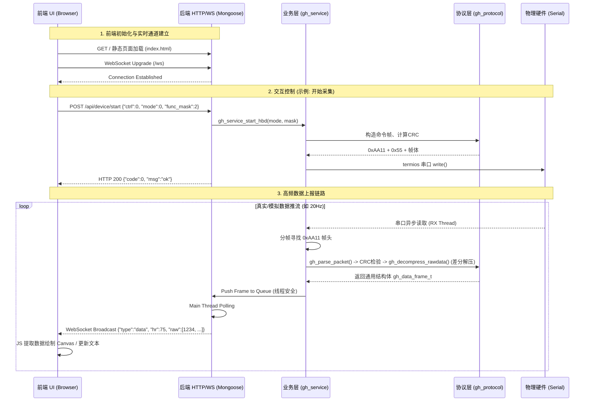

# GH Protocol App - 用户使用指南与测试手册

本文档是针对「GH Protocol」重构后版本（纯C后端 + Web前端）的完整上手使用手册。通过本文档，您可以了解如何编译、运行、测试（包含模拟模式与真实硬件），以及如何使用Web前端界面与API接口。

---

## 1. 快速上手：编译与运行

本项目使用 `CMake` 作为构建系统，核心后端基于纯C语言实现，前端为单页HTML应用，并通过集成的Web服务器（基于Mongoose）进行托管。

### 1.1 编译工程

请在终端中执行以下命令生成构建目录并编译：

```bash
cd refactor_output
chmod +x build_and_run.sh
./build_and_run.sh
```
*注：脚本会自动创建 `build` 文件夹、下载 Mongoose 依赖库并并行编译出可执行文件 `gh_backend`。*

---

### 1.2 启动测试模式 (模拟模式)

如果您手头**没有真实的串口设备**，可以使用模拟模式启动。在该模式下，后端服务会自动产生模拟的生理特征数据（如PPG波形、心率），供您验证前后端的实时通信和UI显示逻辑。

**运行命令：**
```bash
./build_and_run.sh --sim
# 或者
cd build
./gh_backend --sim
```

**模拟数据说明：**
系统会拉起一个20FPS（50ms间隔）的模拟器线程，输出正弦波叠加计算出的假体征数据推送至前端。

---

### 1.3 连接真实硬件设备

如果您有一块配置好支持该GH协议的板子，并且通过USB转串口或Type-C连接到了电脑，可以使用指定的设备节点运行：

**运行命令：**
```bash
# macOS 示例：
./build_and_run.sh --port /dev/cu.usbserial-0001 --baud 400000

# Linux 示例：
./build_and_run.sh --port /dev/ttyUSB0 --baud 400000

# Windows 示例：
gh_backend.exe --port COM3 --baud 400000
```
> **提示**：如果在指定的串口节点无法成功打开，系统会自动**降级到模拟模式**并提示警告，请留意终端日志。

---

## 2. Web 界面功能详解

启动后端后，在浏览器中访问：**http://localhost:8080** 即可看到控制面板。

整个平台分为左侧控制区和右侧数据展示区：

### 2.1 串口连接控制 (左上卡片)
*   **串口设备**：输入或选择目标串口路径（如 `/dev/ttyUSB0`）。
    * *API接口会在页面启动时自动通过 `/api/serial/list` 检测可用设备（若受支持）。*
*   **波特率**：默认推荐 `400000` (取决于固件端设置)。
*   **「连接/断开设备」按钮**：触发后端串口资源的分配和释放。若是模拟模式，连接按钮表示允许将模拟器数据流“挂载”到处理队列中。

### 2.2 采集控制 (左中卡片)
用于控制传感器启动采样，并选择下发的通道与模式设定。

*   **功能通道掩码 (Function Mask)**
    *   **心率 (HR)**: `0x02`
    *   **血氧 (SPO2)**: `0x20`
    *   **ECG**: `0x40`
    *   **HRV**: `0x04`
    *   **血压**: `0x10`
    *   **ADT**: `0x01`
    *   *勾选多项时，掩码通过按位或 (Bitwise OR) 组合下发给硬件，告知硬件同时采集哪些生理指征。*
*   **采样模式**
    *   **EVK 模式 (0)**：标准评估/开发板模式，通常会发送最详尽的底层RAW和诊断数据。
    *   **Verify 模式 (1)**：验证/生产验证模式，精简上报频率或仅关注计算出的最终结果值。
*   **操作按钮**：「▶ 开始采集」下发 `ctrl:0` 命令，硬件启动测量；「■」下发 `ctrl:1` 命令，停止传输和测量。

### 2.3 实时数据展示 (右侧大区)
当你点击“开始采集”后，此处将呈现真实或模拟的数据：
*   **指标面板 (HR, SPO2, 帧数)**：从解压后的数据包中抽取出最终算法结果展示。
*   **实时波形**：绘制RAW数据的第一通道 `raw[0]`（如 PPG Green 对应的 ADC 数据），具有平滑曲线和阴影样式。由于 WebSocket 具备低延迟特性，视觉效果非常流畅（约20FPS）。
*   **通信日志**：在界面底部监控 WebSocket 握手情况及每一次 API 交互。

### 2.4 寄存器配置 (右下卡片)
*   允许通过界面下发底层硬件寄存器读写指令（Hex 格式）。
*   *用法*：点击 **「+ 添加」** 创建行，填写如 `0x0102` (地址) 与 `0x0001` (数据)，点击 **「发送」**，此配置会打包至 `0xAA11` 帧内传至串口。

---

## 3. 前后端联动流程图

该系统架构完全解除了对原 Qt GUI 的绑定，采用 `C后端 -> WebSocket/REST -> 浏览器` 的现代Web联动模式。



---

## 4. API 接口字典

在此列出所有对外的后端控制接口，方便客户直接通过 Postman 或 Python 脚本发起自动化测试。

所有接口基础路径为：`http://localhost:8080`

### 4.1. 获取设备状态
*   **请求**：`GET /api/device/status`
*   **描述**：获取后端当前的串口通信状态与运行模式。
*   **响应示例**：
    ```json
    {
      "code": 0,
      "msg": "ok",
      "data": {
        "state": "connected",
        "port": "/dev/ttyUSB0",
        "baud_rate": 400000,
        "sim_mode": false
      }
    }
    ```

### 4.2. 连接/断开串口
*   **请求**：`POST /api/device/connect`
*   **Body 参数**：
    *   `port`: 串口名称 (如 `"/dev/ttyUSB0"`, `"COM3"`)
    *   `baud_rate`: 波特率整数 (如 `400000`)
*   **请求**：`POST /api/device/disconnect` (无 Body)

### 4.3. 开始/停止采样 (StartHBD)
*   **请求**：`POST /api/device/start`
*   **Body 参数**：
    *   `ctrl`: 控制位。`0` 表示开始采集，`1` 表示停止采集。
    *   `mode`: 工作模式。`0` 为 EVK 原型开发模式，`1` 为 Verify 生产模式。
    *   `func_mask`: 功能位图 (如 `0x02` 心率, `0x20` 血氧)。

### 4.4. 寄存器组下发
*   **请求**：`POST /api/device/config`
*   **描述**：下发一到多个底层硬件寄存器的配置参数。
*   **Body 参数**：
    ```json
    {
      "regs": [
        {"addr": 258, "data": 1},
        {"addr": 768, "data": 100}
      ]
    }
    ```

### 4.5. 实时数据流通道 (WebSocket)
*   **URL**：`ws://localhost:8080/ws`
*   **描述**：后端异步无条件广播设备状态与解压计算后的传感器数据帧。
*   **服务器推送事件示例**：
    ```json
    {
       "type": "data",
       "func_id": 1,
       "frame_cnt": 352,
       "hr": 78,
       "raw": [116000, 95000, 74000, 52000],
       "algo": [78],
       "gsensor": [15, 42, 1000],
       "ts": 1774401667450
    }
    ```

---
*文档生成：GH Protocol C/Web Full-Stack Refactor (Version 1.0)*
